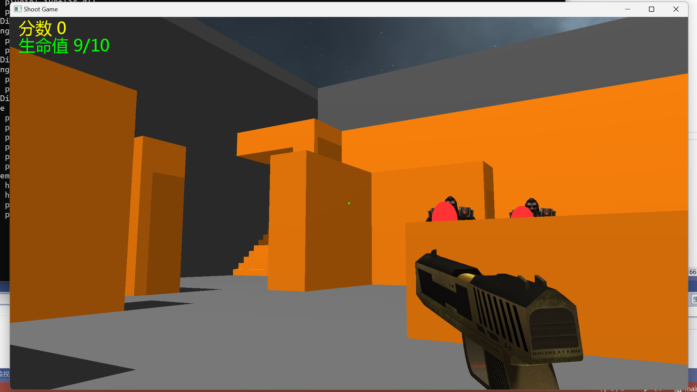

# Shoot Game

## 预览

地图上会随机生成怪物，左上角有生命值和分数显示；
游戏中一分钟为一天，地图上会有昼夜变换。

## 使用方法

代码环境：Windows10，Visual Studio2022

1. 下载代码，打开sln文件
2. 将library中的include文件夹添加至附加包含目录
3. 将library中的lib文件夹添加至附加库目录
4. 将opengl32.lib;glew32d.lib;irrKlang.lib;freetype.lib;添加到附加依赖项
5. 运行代码
